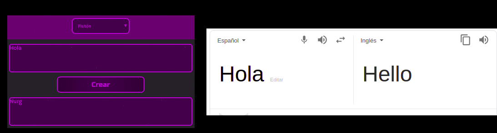
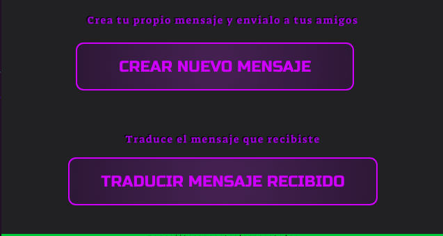
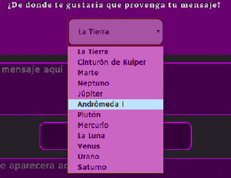
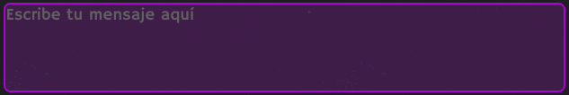
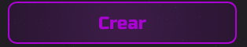
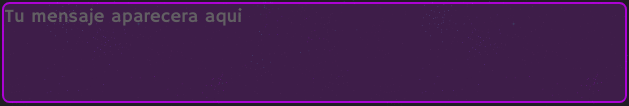
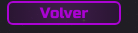
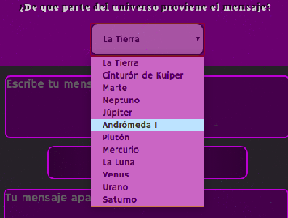
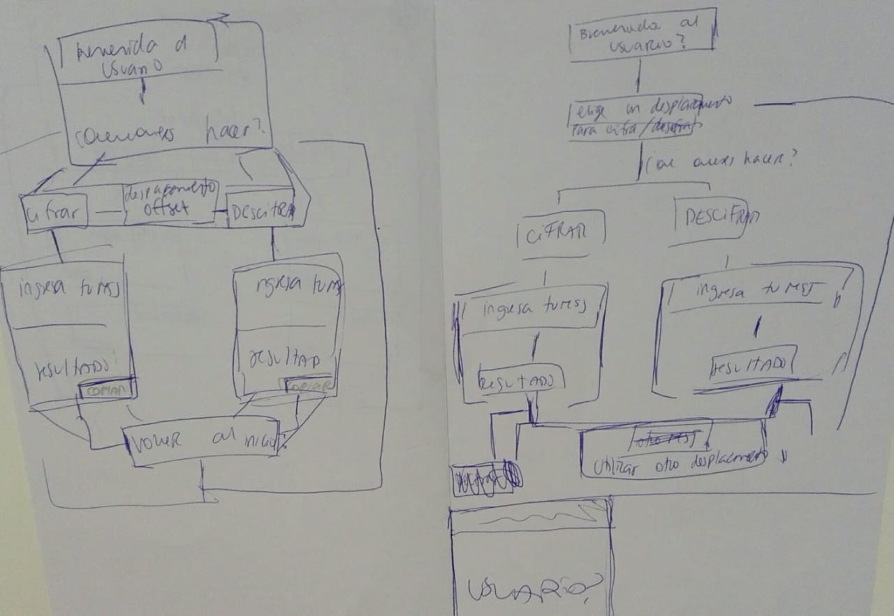
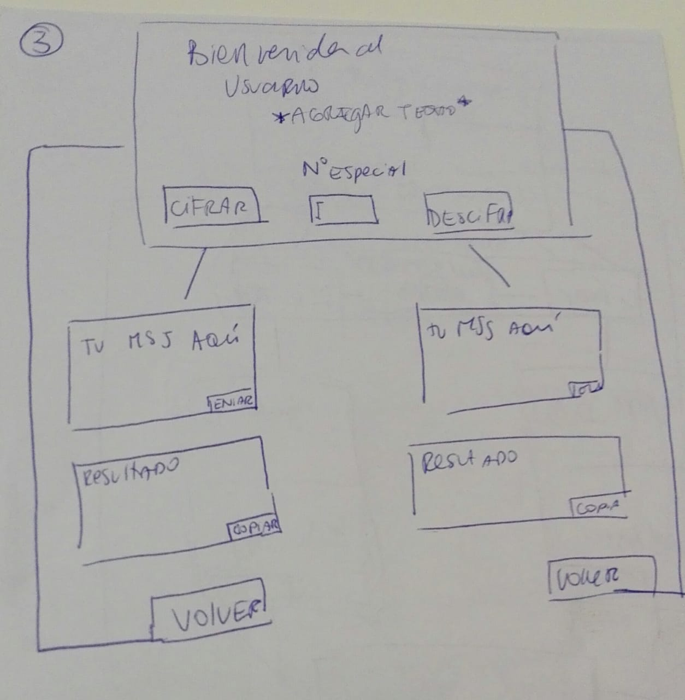

# Resumen del proyecto
En esta app web, el usuario puede *cifrar* o *descifrar* un texto segun el *desplazamiento* de caracteres que seleccione, utilizando el metodo de [cifrado César](https://en.wikipedia.org/wiki/Caesar_cipher).

La temática esta basada en *crear mensajes de otro mundo*, por lo que esta ambientado en galaxias, seres extraterrestres, planetas y elementos del universo en general. 

Básicamente se simula un traductor con idiomas extraterrestres.

 
El usuario puede crear un nuevo mensaje o traducir un mensaje que le hayan entregado mediante esta misma app . Por esta razón cifrar es nombrado como **CREAR NUEVO MENSAJE** y descifrar como **TRADUCIR MENSAJE RECIBIDO**. 

Por otra parte, el 'desplazamiento' es una lista seleccionable de diferentes lugares del universo que poseen cada una un valor numerico que se  utiliza como desplazamiento.

Lista de nombres con sus valores

| Nombre      | Desplazamiento|
| ----------- | ----------- |
| La Tierra      |     0     |
| Cinturón de Kuiper   |     1    |
| Marte     | 2     |
| Neptuno  |     3    |
| Júpiter      | 4     |
| Andrómeda I   |     12    |
| Plutón     | 6     |
| Mercurio  |     7    |
| La Luna      | 22     |
| Venus      | 8    |
| Urano    |     33   |
| Saturno    | 15     |

## Instrucciones
### Para crear un nuevo mensaje 

1. Selecciona 'CREAR NUEVO MENSAJE'.

2. Elige un lugar de la lista desplegable
(debes indicarle a quien reciba tu mensaje el mismo lugar que elijas aqui para luego poder traducir tu mensaje.)

3. Escribe tu mensaje en la caja de texto superior.

4. Selecciona 'CREAR'

5. Visualiza tu mensaje creado en la caja de texto inferior.

6. Si quieres volver a la página principal selecciona 'VOLVER'.

### Para traducir un mensaje recibido

1. Selecciona 'TRADUCIR MENSAJE RECIBIDO'.

2. Elige el lugar de la lista desplegable que te indicó el creador del mensaje.

3. Escribe el mensaje que recibiste en la caja de texto superior.

4. Selecciona 'TRADUCIR'.

5. Visualiza el mensaje traducido en la caja de texto inferior.

6. Si quieres volver a la página principal selecciona 'VOLVER'.

# Usuario
Esta app va principalmente dirigida a un público infantil, con gustos relacionados con la ciencia-ficcion y seres extraterrestres. Personas que no coincidan con la edad pero que compartan de igualmente un gusto por estos temas son considerados usuarios de igual forma, ya que el principial objetivo de esta app es simplemente jugar.

Lo que ofrece esta app es una forma diferente y mas divertida de comunicación, poder tener conversaciones secretas con amigos, publicar un mensaje fuera de lo común en redes sociales, etc.

### Decisiones  
En una primera etapa, cuando el usuario aun no estaba bien definido, la interfaz estaba diseñada para cumplir con el objetivo de un típico cifrado César. El usuario debía escribir un 'Desplazamiento' y luego seleccionar 'Cifrar' o 'Descifrar', esto los llevaba a otra página donde podían escribir su mensaje y visualizar el resultado.
 
 

Luego de esta primera etapa se decidio que el usuario no debia por qué saber como funcionaba un cifrado cesar, por lo que el 'Desplazamiento' se nombro como 'Numero Especial' o  'Clave'.

Finalmente se definio por completo la tematica de la app 'Crear mensajes de otro mundo' y se trabajo mediante esta idea. Se remplazaron los nombres de 'Cifrar', 'Descifrar' y 'Desplazamiento' por otros que fueran mas amigables con nuestro usuario( que desconoce la matemática detrás del cifrado cesar).

*Pasó de ser un cifrado cesar a un traductor extraterrestre.*

Se seleccionaron colores azules y magentas para simular la tonalidad del espacio exterior y el caracterisco verde asociado a los extraterrestres para una completa ambientacion. 